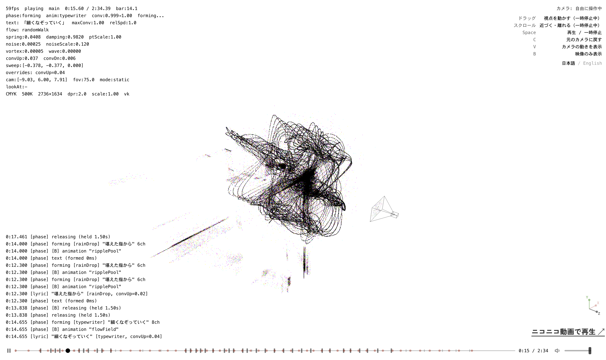

# nibi

WebGPU パーティクル MV のソースコードです。

粒子が日本語歌詞テキストの形状にしたがって3D空間に配置し、パターンへと遷移します。Three.js WebGPU + TSL compute shader で実装しています。

Source code for a WebGPU particle music video. Particles arrange into Japanese lyrics in 3D space — readable only from the authored camera angle — and transition into flow patterns. Built on Three.js WebGPU with TSL compute shaders.

Demo: https://monotonmusic.com/nibi/

MV本編 (Niconico): https://www.nicovideo.jp/watch/sm45971593



## Stack

- [Three.js](https://threejs.org/) r182 — WebGPU / WebGL 2 renderer
- TSL (Three.js Shading Language) — GPU compute shaders
- [GSAP](https://gsap.com/) — Camera keyframe animation
- [Vite](https://vite.dev/) — Dev server / build
- [mp4-muxer](https://github.com/nicklausw/mp4-muxer) — Offline video export

## Setup

```bash
git clone https://github.com/monoton-music/nibi.git
cd nibi
npm install
npm run dev
```

WebGPU 対応ブラウザで最適に動作します。非対応の場合は WebGL 2 にフォールバックします。

Best experienced on WebGPU-capable browsers. Falls back to WebGL 2 when unavailable.

## Structure

```
src/
├── main.js                         Entry point
├── engine/
│   ├── MVEngine.js                 Orchestrator, UI, i18n
│   ├── SceneManager.js             Three.js WebGPU scene lifecycle
│   ├── CameraController.js         Keyframe camera (path, orbit, dolly, shake)
│   ├── PostProcessing.js           TSL post-FX (color inversion, grain, vignette)
│   ├── AudioManager.js             Web Audio playback + analysis
│   ├── Timeline.js                 Time-based scene/event dispatch
│   └── OfflineRenderer.js          MP4 export (H.264 / VP9)
├── components/
│   ├── GPUParticleSystem.js        Particle system (compute shader, 4-phase state machine)
│   ├── gpuFlowPatterns.js          13 GPU flow patterns (TSL)
│   └── flowPatterns.js             5 CPU flow patterns (fractal/recursive)
└── utils/
    ├── DebugOverlay.js             FPS / stats overlay
    ├── SceneTuner.js               Live parameter editor
    └── SeededRandom.js             Deterministic RNG

public/
├── mv-data.json                    Lyrics timing, camera keyframes, physics params
└── assets/
    ├── audio/demo.mp3
    └── svg/
```

## Particle Phases

```
flow → forming → text → releasing → flow
```

- **flow**: Particles follow GPU/CPU target patterns (galaxySpin, fractalTree, etc.)
- **forming**: Particles assemble toward text positions via one of 16 formation animations
- **text**: Particles hold readable text (legible only from the authored camera angle; other angles see an abstract point cloud)
- **releasing**: Particles dissolve back toward flow targets

All timing and physics are driven by `mv-data.json`.

## URL Parameters

| Param | Description |
|-------|-------------|
| `?debug=1` | Debug overlay |
| `?tuner=1` | Scene parameter editor |
| `?autoplay=1` | Auto-start |
| `?demo=1` | Pattern demo (no lyrics) |
| `?lyrics=0` | Disable lyrics |
| `?scene=ID` | Start scene |
| `?loop=1` | Loop scene |
| `?export=1` | MP4 export |

## Keys

| Key | Action |
|-----|--------|
| Space / P | Play / Pause |
| R | Reset |
| [ / ] | Prev / Next scene |
| D | Debug overlay |
| B | Explore mode (探索モード) |

## License

Copyright (c) 2026 monoton / Haruma Tasaki

All Rights Reserved. 非営利・良識の範囲の二次創作は許可します。詳細は [LICENSE](./LICENSE) を参照。

Non-commercial use and derivative works in good faith are permitted. See [LICENSE](./LICENSE).

Zen Kaku Gothic New: [SIL Open Font License](./src/assets/fonts/OFL.txt)
